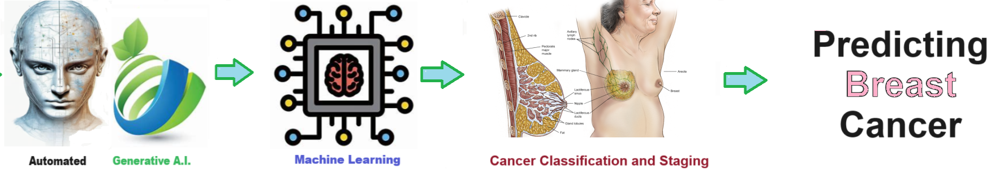
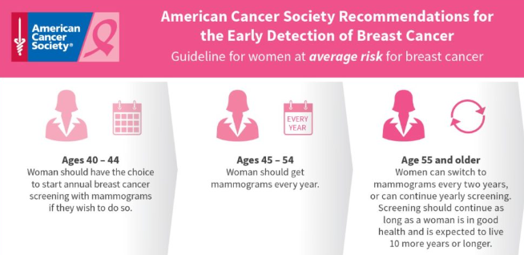
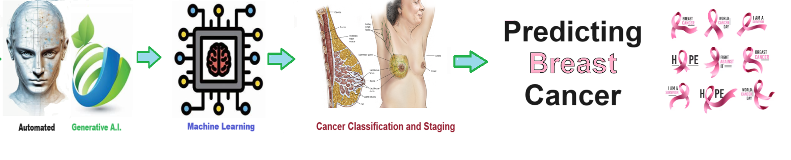
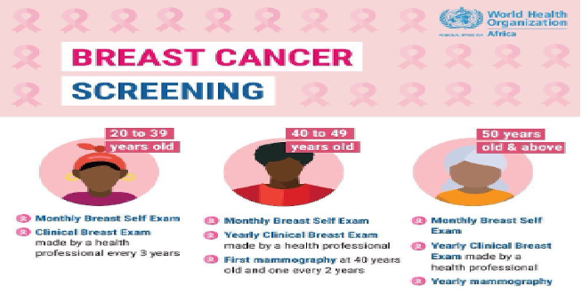

    
# Predicting Breast Cancer 

## Machine learning for predicting breast cancer.

    


    
## Table of Contents

- [Solution Overview](#solution-overview)
- [Who will use this ?](#who-can-use)
- [Advantages of Using](#advantages-of-using)
- [Return on Investment (ROI)](#return-on-investment-roi)
- [How it Works](#how-it-works)
- [Conclusion](#conclusion)
- [Getting Started](#getting-started)
- [Solution Features](#solution-features)
- [Code Features](#code-features)
- [Deliverables or Figures](#deliverables-or-figures)
- [Contact Information](#contact-information)


## Pedicting Breast Cancer 

Here’s an updated **README.md** file for the **Predicting Breast Cancer** project, now including the variables used for prediction:

---

# Predicting Breast Cancer

This project aims to predict the onset of **breast cancer** within the next year using **10 different machine learning models**. Each model is evaluated based on accuracy and performance, and a comparison is provided to identify the best-performing algorithm. The dataset includes various health-related variables, and machine learning models are used to predict the likelihood of developing breast cancer.

The project is based on an adapted notebook from Kaggle: [Original Kaggle Notebook](https://www.kaggle.com/code/sandragracenelson/Breast-cancer-prediction).

## Table of Contents
- [Introduction](#introduction)
- [Variables Used for Prediction](#variables-used-for-prediction)
- [Models Used](#models-used)
- [Installation](#installation)
- [Usage](#usage)
- [Results](#results)
- [Contributing](#contributing)

## Introduction

Breast cancer is one of the most common cancers affecting women worldwide. Early detection through predictive modeling can play a crucial role in improving treatment outcomes. This project utilizes several machine learning algorithms to develop a predictive model based on health-related variables. The aim is to compare the accuracy and efficiency of 10 models to determine the most effective in predicting the likelihood of breast cancer.

## Variables Used for Prediction

The following variables are analyzed to make predictions about the onset of breast cancer:

- **Gender**
- **Age**
- **Smoking**
- **Yellow fingers**
- **Anxiety**
- **Peer pressure**
- **Chronic disease**
- **Fatigue**
- **Allergy**
- **Wheezing**
- **Alcohol consumption**
- **Coughing**
- **Shortness of breath**
- **Swallowing difficulty**
- **Chest pain**
- **Breast cancer** (history)

These variables are used as input features for the machine learning models to predict whether a patient is at risk of developing breast cancer in the next year.

## Models Used

Here is a brief description of each machine learning model used in this project:

1. **Logistic Regression**:  
   A linear model used for **binary classification** problems. It estimates the probability of an instance belonging to a particular class and is effective for problems where the classes are separable linearly.

2. **Decision Tree**:  
   A model that uses a **tree-like structure** to make decisions by splitting the dataset into subsets based on the values of input features. It is intuitive and easy to interpret but can be prone to overfitting.

3. **K-Nearest Neighbor (KNN)**:  
   A **non-parametric** algorithm that classifies instances based on their proximity to other data points in the feature space. It looks at the 'k' nearest data points and assigns the majority class to the query point.

4. **Gaussian Naive Bayes**:  
   A **probabilistic classifier** based on Bayes' theorem, assuming that features are independent of each other. It is widely used for text classification but can be applied to continuous data by assuming a Gaussian distribution.

5. **Multinomial Naive Bayes**:  
   Similar to Gaussian Naive Bayes, but suited for tasks with **discrete features** like word counts. It is frequently used in natural language processing (NLP).

6. **Support Vector Classifier (SVC)**:  
   An algorithm that finds the **optimal hyperplane** to separate different classes in high-dimensional space. It is robust and effective for small- to medium-sized datasets, often used for binary classification problems.

7. **Random Forest**:  
   An **ensemble learning** method that combines multiple decision trees to improve prediction accuracy. It reduces the risk of overfitting by averaging the results of individual trees.

8. **XGBoost**:  
   A powerful and optimized version of the gradient boosting algorithm. **XGBoost** is known for its speed and efficiency, making it highly effective for large datasets and complex tasks.

9. **Multi-layer Perceptron (MLP)**:  
   A type of **artificial neural network** that consists of multiple layers of nodes. MLPs are capable of learning non-linear relationships and are widely used for complex classification problems.

10. **Gradient Boosting Classifier**:  
    This algorithm builds an ensemble of **weak learners** (usually decision trees), where each new tree focuses on correcting the errors made by the previous trees. It produces strong predictive models by combining the output of these learners.

## Installation

1. Clone this repository:
   ```bash
   git clone https://github.com/yourusername/predicting_breast_cancer.git
   cd predicting_breast_cancer
   ```

2. Install dependencies using `pip`:
   ```bash
   pip install -r requirements.txt
   ```

## Usage

1. Load the Jupyter Notebook `breast_cancer_prediction.ipynb` in your environment:
   ```bash
   jupyter notebook breast_cancer_prediction.ipynb
   ```

2. Run each cell of the notebook to execute the models, train them on the breast cancer dataset, and evaluate their performance.

3. The notebook will display visualizations and performance metrics (accuracy, precision, recall, etc.) for each of the 10 models.

## Results

The performance of each model is evaluated based on accuracy, precision, recall, and other key metrics. The following is a summary of model performances (details available in the notebook):

- **Logistic Regression**: Good baseline accuracy and easy to interpret.
- **Decision Tree**: High interpretability but prone to overfitting.
- **KNN**: Works well for small datasets but can be slow for large datasets.
- **Gaussian Naive Bayes**: Performs well when feature independence is a valid assumption.
- **Multinomial Naive Bayes**: Best suited for discrete feature sets.
- **SVC**: Effective but can be slow on large datasets.
- **Random Forest**: High accuracy with less overfitting, robust to noise.
- **XGBoost**: One of the best-performing models, especially on larger datasets.
- **MLP**: Handles complex, non-linear relationships but may require more tuning.
- **Gradient Boosting Classifier**: High accuracy but computationally intensive.

## Contributing

Contributions are welcome! To contribute:

1. Fork this repository.
2. Create a new branch:
   ```bash
   git checkout -b feature-branch
   ```
3. Make your changes and commit them:
   ```bash
   git commit -m "Add feature"
   ```
4. Push to the branch:
   ```bash
   git push origin feature-branch
   ```
5. Open a pull request.

---

This **README.md** provides a clear and structured overview of the project, explaining the variables and machine learning models used for predicting breast cancer. It ensures that users understand the models and the process while giving detailed instructions on how to run the notebook.


    


    
## Getting Started

The goal of this solution is to **Jump Start** your development and have you up and running in 30 minutes. 

To get started with the **Predicting Breast Cancer** solution repository, follow these steps:
1. Clone the repository to your local machine.
2. Install the required dependencies listed at the top of the notebook.
3. Explore the example code provided in the repository and experiment.
4. Run the notebook and make it your own - **EASY !**
    
## Solution Features

- Easy to understand and use  
- Easily Configurable 
- Quickly start your project with pre-built templates
- Its Fast and Automated
- Saves You Time 


## Code Features

These features are designed to provide everything you need for **Predicting Breast Cancer** 

- **Self Documenting** - Automatically identifes major steps in notebook 
- **Self Testing** - Unit Testing for each function
- **Easily Configurable** - Easily modify with **config.INI** - keyname value pairs
- **Includes Talking Code** - The code explains itself 
- **Self Logging** - Enhanced python standard logging   
- **Self Debugging** - Enhanced python standard debugging
- **Low Code** - or - No Code  - Most solutions are under 50 lines of code
- **Educational** - Includes educational dialogue and background material

    
## List of Figures
   <br>  <br>  <br>
    

## Github https://github.com/JoeEberle/ - Email  josepheberle@outlook.com 
    


    