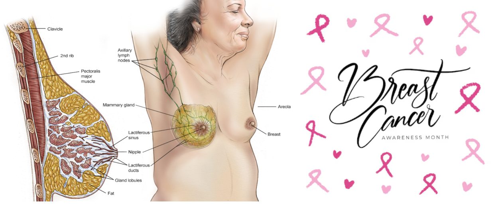

# Predicting Breast Cancer - Machine learning for predicting breast cancer.
Machine learning for predicting breast cancer.

Welcome to the solution **Predicting Breast Cancer** - an example for your projects

Machine learning for predicting breast cancer.

## Getting Started
To get started with the **Predicting Breast Cancer** solution repository, follow these steps:
1. Clone the repository to your local machine.
2. Install the required dependencies listed at the top of the notebook.
3. Explore the example code provided in the repository and experiment.
4. Run the notebook and make it your own - **EASY !**
    
## Solution Features
- Easy to understand and use  
- Easily Configurable 
- Quickly start your project with pre-built templates
- Its Fast and Automated

## Notebook Features
- **Self Documenting** - Automatically identifes major steps in notebook 
- **Self Testing** - Unit Testing for each function
- **Easily Configurable** - Easily modify with **config.INI** - keyname value pairs
- **Includes Talking Code** - The code explains itself 
- **Self Logging** - Enhanced python standard logging   
- **Self Debugging** - Enhanced python standard debugging
- **Low Code** - or - No Code  - Most solutions are under 50 lines of code
- **Educational** - Includes educational dialogue and background material
- **Secure** - All the sample solutions are secure and use synthetic data, ensuring they contain no sensitive data or information.
    
## Deliverables or Figures
          
    

## Github    
## https://github.com/JoeEberle/ 

## Email 
## josepheberle@outlook.com 

    

    